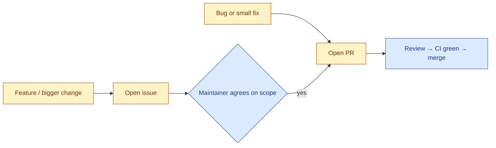

# Contributing to Straude

Thanks for helping make Straude better. This guide is short on purpose — Straude is a small project and we want to keep contributing lightweight.

## TL;DR

- **Bug fix?** Just open a PR. Reference the issue if there is one.
- **Small docs / copy / typo fix?** Just open a PR.
- **New feature or bigger change?** Open an issue first so we can sanity-check scope before you spend time coding. A short comment thread is enough — we don't require a written spec.
- Run `bun run typecheck`, `bun run test`, and `bun run build` before opening the PR. The pre-push hook does this for you (see [Setup](#setup)).
- One PR = one logical change.

## Setup

Full instructions live in [`docs/SETUP.md`](docs/SETUP.md) and [`docs/LOCAL_DEV.md`](docs/LOCAL_DEV.md). The short version:

```bash
git clone <your-fork-url> && cd straude
bun install
bun run local:setup   # starts local Supabase, writes .env.local, seeds demo data
bun run dev           # http://localhost:3000
```

Enable the pre-push hook so you can't push code that fails CI:

```bash
git config core.hooksPath .githooks
```

Prerequisites: Bun ≥ 1.3.3, Node ≥ 18, Docker (for local Supabase). The pre-push hook runs typecheck, build, and tests — exactly what CI runs.

## Filing a Good Issue

Search [existing issues](https://github.com/ohong/straude/issues) first.

**Bug reports** — include:

- A one-paragraph summary and steps to reproduce.
- Expected vs. actual behavior.
- Your environment: OS, Node/Bun version, and (if it's a CLI bug) the output of `npx straude@latest --version`.
- Logs, screenshots, or a `--dry-run` paste when relevant.

**Feature requests** — describe the user-facing problem before any proposed solution:

- Who hits this and what they're trying to do.
- What's missing or painful about the current behavior.
- A rough sketch of the desired outcome (a paragraph or a mock — no spec required).

If a maintainer comments "go for it" or labels the issue `ready`, you're cleared to open a PR. Tiny / obvious fixes can skip the issue and go straight to a PR.

## Contribution Flow



## Opening a PR

1. Branch from `main`, prefixed with your handle: `alice/fix-streak-rollover`.
2. Make the change. Keep the diff focused on one logical thing.
3. Add or update tests (see [Testing](#testing)).
4. Run the checks locally — they should all pass:

   ```bash
   bun run typecheck   # apps/web
   bun run test        # turbo: apps/web + packages/cli
   bun run build       # turbo: full build, with placeholder Supabase env vars
   ```

   Or just `git push` with the pre-push hook enabled — it runs all three.

5. Add a `docs/CHANGELOG.md` entry under `## Unreleased` if your change is user-visible. Use Keep a Changelog sections (`Added` / `Changed` / `Fixed` / `Removed`). Skip for pure refactors and internal docs.
6. Open the PR. Title in the imperative mood ("fix streak rollover at UTC midnight"). The description should explain the *why*, not just the *what* — the diff covers the *what*.
7. Link the issue with `Closes #123` if there is one.

A maintainer will review. CI must be green before merge.

## Testing

The bar is "would this have caught the bug if it had existed before?" — not 100% coverage.

- **Bug fixes** should include a regression test. Vitest unit test in most cases; Playwright e2e if it's a user-visible flow regression.
- **New behavior** in `apps/web/lib/` or `packages/cli/src/` needs unit tests.
- **New user-facing flows** (auth, onboarding, posting, leaderboard) should have a Playwright spec under [`apps/web/e2e/`](apps/web/e2e/) when the behavior can reasonably be exercised end-to-end.
- **UI-only tweaks** (copy, spacing, color) don't need a test — but the pre-push hook still has to pass.

Run tests:

```bash
bun --cwd apps/web test                  # unit (vitest + jsdom, mock-based)
bun --cwd apps/web test:integration      # integration (vitest + real Supabase)
bun --cwd apps/web test:e2e              # e2e (playwright, chromium)
bun --cwd packages/cli test              # CLI unit (vitest)
```

Integration tests in `apps/web/__tests__/integration/` exercise the real route handlers against a real local Supabase stack — full migration history, real Postgres, real PostgREST, real CLI JWT signing. Avoid `vi.mock` in this directory; that's the whole point. Start the stack with `bun run local:up` (or `bunx supabase start`) before running them. CI starts it automatically. See `apps/web/__tests__/integration/usage-submit.test.ts` for the pattern.

## Code Style

- TypeScript strict; let `tsc` and `eslint` enforce the rest.
- No `NEXT_PUBLIC_` prefix on server-only env vars.
- Don't import Supabase admin / service-role clients in client components.
- Only use colors from `apps/web/app/globals.css` `@theme` — accent is `#DF561F`.
- Next.js 16 uses `proxy.ts`, **not** `middleware.ts`. Don't create one.
- Prefer editing existing files over adding new ones.

The rest is in [`CLAUDE.md`](CLAUDE.md) — those rules apply to humans too, not just agents.

## Using a Coding Agent

Straude was built almost entirely with coding agents — Claude Code and Codex — and the repo ships with agent-readable context: [`CLAUDE.md`](CLAUDE.md), skills under [`.agents/skills/`](.agents/skills/), and the docs in [`docs/`](docs/). Use any agent (Claude Code, Codex, Cursor, etc.) — or none. We don't care how the code gets written, only that it's good and that you understand what you're submitting.

If your PR was authored mostly by an agent, that's fine — please skim the diff and make sure it actually does what the description says before requesting review.

## Security

**Don't open public issues for security vulnerabilities.** Use GitHub's private vulnerability reporting from the repo's Security tab, or email the maintainer.

Past audit findings live in [`docs/SECURITY.md`](docs/SECURITY.md).

## Code of Conduct

Be kind. Disagree about code, not people. We follow the spirit of the [Contributor Covenant](https://www.contributor-covenant.org/version/2/1/code_of_conduct/) — harassment, personal attacks, and bad-faith behavior get you uninvited from the project.

## Getting Help

- [Setup guide](docs/SETUP.md) and [local dev](docs/LOCAL_DEV.md) for environment issues.
- [Roadmap](docs/ROADMAP.md) for what's planned but not yet started.
- [GitHub issues](https://github.com/ohong/straude/issues) for bugs and feature requests.
